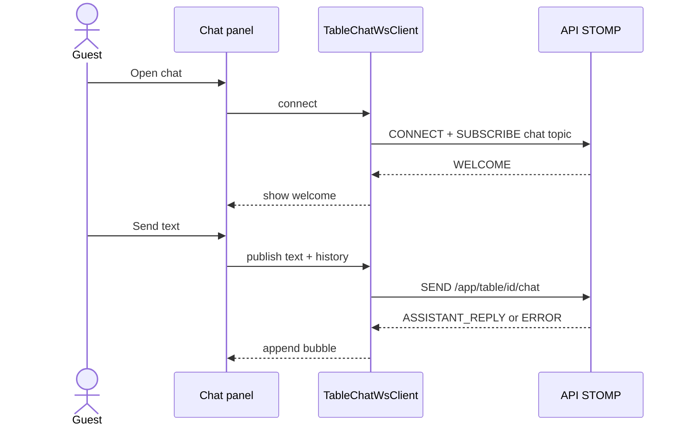

# Table Chatbot

---

## Summary

Customer-facing AI chat on `/table/[tableId]`. The UI lives in `modules/chatbot`. Transport is STOMP to the Milly API: send on `/app/table/{tableId}/chat`, receive on `/topic/table/{tableId}/chat`.

---

## Table of contents

1. [Where it mounts](#where-it-mounts)
2. [STOMP contract](#stomp-contract)
3. [Message model](#message-model)
4. [Chat flow](#chat-flow)
5. [Limits and failure UI](#limits-and-failure-ui)
6. [Env dependencies](#env-dependencies)

---

## Where it mounts

- Entry: customer `TableClient` opens chat via `ChatbotIconButton` / panel components under `modules/chatbot/components`.
- WS client connects when the chat panel is active (not necessarily for the whole table session).
- Separate from the **order** table WS client (`modules/customer`), which only subscribes to `/topic/table/{tableId}` for refresh signals.

---

## STOMP contract

| Direction | Destination | Auth |
|-----------|-------------|------|
| Connect | `{NEXT_PUBLIC_WS_URL}/ws` (no ticket) | Anonymous |
| Subscribe | `/topic/table/{tableId}/chat` | Same table bind as backend guard |
| Send | `/app/table/{tableId}/chat` | Same |

Client implementation: `modules/chatbot/ws/tableChatWsClient.ts` (`@stomp/stompjs`). URL helpers: `modules/shared/ws` + chatbot `ws/config`.

Payload send:

```json
{ "text": "What vegetarian options do you have?", "history": [{ "role": "user", "content": "…" }] }
```

`history` is built from the in-panel conversation (roles `user` | `assistant`). Backend keeps at most the last 10 history items for the model.

---

## Message model

Inbound events (`ChatMessageEvent`):

| `type` | UI meaning |
|--------|------------|
| `WELCOME` | Greeting after subscribe |
| `ASSISTANT_REPLY` | Model answer |
| `ERROR` | Shown as an error bubble / notice |

Local user messages are appended in the UI when sending; they are not echoed by the server as a separate event type.

---

## Chat flow



Hook surface: `useTableChatWs`, `useChatConversation` (send + local list).

---

## Limits and failure UI

| Rule | Constant / behaviour |
|------|----------------------|
| Max messages in panel | `MAX_CHAT_MESSAGES = 10` (`constants.ts`) — composer blocks when reached |
| Empty send | Ignored client-side |
| Disconnect | Auto reconnect delay ~1.5s while panel wants a connection |
| AI disabled on backend | `ERROR` event with unavailable message |

Chat has no REST fallback; it requires a working WS URL to the backend.

---

## Env dependencies

| Variable | Role |
|----------|------|
| `NEXT_PUBLIC_WS_URL` | Required in typical local/prod setups where REST is proxied through Next |

If WS points at the wrong host, the order board may still work via REST while chat stays disconnected.

Related: [routes.md](./routes.md) (`/table/[tableId]`), [system-design.md](./system-design.md), [installation.md](./installation.md).
