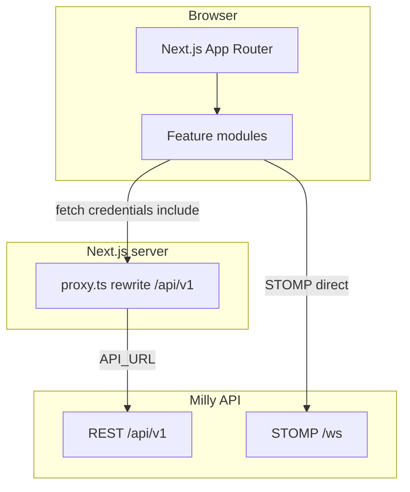

# System Design

---

## Summary

**milly-front** is the Next.js client for Milly. It serves onboarding, staff venue portals, system admin, and anonymous customer table ordering. REST goes to the Milly API (`/api/v1`); live updates and table chat use STOMP over WebSocket (`/ws`).

---

## Table of contents

1. [System context](#system-context)
2. [High-level architecture](#high-level-architecture)
3. [Modules](#modules)
4. [UI styling](#ui-styling)
5. [How the app reaches the API](#how-the-app-reaches-the-api)
6. [Related documentation](#related-documentation)

---

## System context

| Surface | Who | Entry |
|---------|-----|-------|
| Marketing / auth | Anyone | `/`, `/login`, `/signup` |
| Onboarding | Authenticated user | `/register-venue`, `/join-venue` |
| Staff portal | Venue member | `/venue/{venueId}/staff/...` |
| Admin | System `ADMIN` | `/admin/users` |
| Customer table | Anonymous guest | `/table/{tableId}` |

Users authenticate **globally** (cookies from the API). Venue access is checked per `venueId` on staff routes. Customers need no account.

---

## High-level architecture

- **Pages** live under `src/app` (routing only).
- **Domain UI and clients** live under `src/modules`.
- **Proxy** (`src/proxy.ts`): rewrites `/api/v1/*` to the backend and gates selected page paths on the `access-token` cookie.
- **WebSocket** is **not** proxied; the browser connects to `NEXT_PUBLIC_WS_URL` (or a derived origin).

---

## Modules

| Module | Role |
|--------|------|
| `shared` | API client, WS URL helpers, theme, UI primitives, toasts |
| `auth` | Login/signup, session context, Google GSI, route guards |
| `venue` | Register/join venue, invitations, membership context |
| `staff` | Staff shell, members UI, staff venue WS + ticket |
| `tables` | Staff table CRUD, QR |
| `menu` | Staff menu CRUD |
| `orders` | Staff order board |
| `customer` | Public table ordering + table order WS |
| `billing` | Customer payment sheet |
| `chatbot` | Table AI chat UI + chat STOMP client |
| `account` | Settings / profile / appearance |
| `admin` | Platform user admin (`ADMIN` only) |

State is mostly React context and local hooks (no global Redux/React Query store).

---

## UI styling

The UI uses **Tailwind CSS v4** (utility classes) plus small shared components under `modules/shared/ui` and `lucide-react` icons. No separate component library (MUI, Chakra, etc.) is used.

Why Tailwind here:

- Keeps styles next to the markup for the many staff and customer screens without a large shared CSS bundle.
- Works cleanly with Next.js and PostCSS; unused utilities are dropped at build time.
- Theme tokens (light/dark) stay in a thin `shared/theme` layer instead of fighting a third-party design system.

Reusable chrome (buttons, sheets, headers) lives in `shared/ui` so modules do not reinvent primitives.

---

## How the app reaches the API

| Channel | Local default | Notes |
|---------|---------------|-------|
| REST | Browser → same-origin `/api/v1` → rewrite to `API_URL` | Cookies `access-token`, `refresh-token` forwarded |
| WebSocket | `ws://localhost:8080/ws` | Set `NEXT_PUBLIC_WS_URL` when REST uses the proxy |

Staff WS: `POST /api/v1/ws-ticket` then `ws://…/ws?ticket=…`.  
Customer WS: anonymous `/ws`; order topic and chat topic are table-scoped.

See [routes.md](./routes.md) and [chatbot.md](./chatbot.md) for route and chat contracts with the API.

---

## Related documentation

| Document | Covers |
|----------|--------|
| [installation.md](./installation.md) | Clone, env, run with backend |
| [development-instructions.md](./development-instructions.md) | Layout, modules, git |
| [build-instructions.md](./build-instructions.md) | Production build and deploy env |
| [routes.md](./routes.md) | App Router map and access |
| [chatbot.md](./chatbot.md) | Table chat UI and STOMP |
